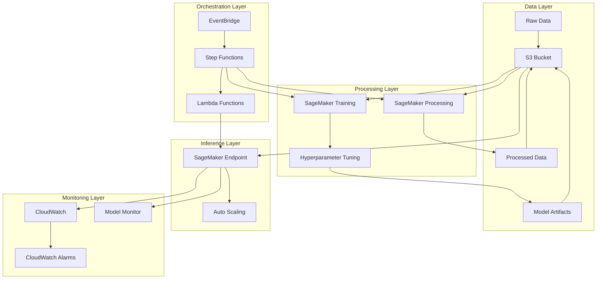

# Design Document: AWS MovieLens Recommendation System

## Overview

This design document describes the architecture and implementation approach for building a scalable movie recommendation system using the MovieLens dataset on AWS infrastructure. The system implements collaborative filtering using matrix factorization to generate personalized movie recommendations.

The solution leverages multiple AWS services to create an end-to-end machine learning pipeline:
- **Amazon S3** for data storage and versioning
- **Amazon SageMaker** for model training, hyperparameter tuning, and inference hosting
- **AWS Lambda** for serverless compute tasks
- **AWS Step Functions** for ML pipeline orchestration
- **Amazon CloudWatch** for monitoring and alerting
- **Amazon EventBridge** for scheduled retraining

The architecture follows AWS best practices for security, scalability, and cost optimization.

## Architecture

### High-Level Architecture



### Data Flow

1. **Ingestion**: MovieLens dataset is downloaded and uploaded to S3 raw-data directory
2. **Preprocessing**: SageMaker Processing job reads raw data, performs transformations, and writes to processed-data directory
3. **Training**: SageMaker Training job reads processed data, trains collaborative filtering model, and saves artifacts to models directory
4. **Evaluation**: Lambda function evaluates model on test set and returns metrics
5. **Deployment**: If evaluation passes threshold, model is deployed to SageMaker endpoint
6. **Inference**: Applications invoke endpoint with user/movie IDs to get predicted ratings
7. **Monitoring**: CloudWatch and Model Monitor track performance and quality metrics

## Components and Interfaces

### 1. S3 Storage Component

**Purpose**: Centralized storage for all data, models, and artifacts

**Directory Structure**:
```
s3://movielens-recommendation-bucket/
├── raw-data/           # Original MovieLens CSV files
├── processed-data/     # Preprocessed train/val/test splits
├── models/             # Trained model artifacts
├── outputs/            # Miscellaneous outputs
├── monitoring/         # Model monitoring data
│   ├── data-capture/
│   ├── baseline/
│   └── reports/
└── metrics/            # Evaluation metrics
```

**Configuration**:
- Versioning enabled for data lineage
- Server-side encryption (SSE-S3 or SSE-KMS)
- Lifecycle policy: Archive to Glacier after 90 days
- Bucket policies for least-privilege access

**Interface**:
- Input: Files uploaded via boto3 S3 client
- Output: Files retrieved via S3 URIs in SageMaker jobs

### 2. Data Preprocessing Component

**Purpose**: Transform raw MovieLens data into training-ready format

**Implementation**: SageMaker Processing job with custom Python script

**Transformations**:
1. Load CSV files (movies.csv, ratings.csv, tags.csv, links.csv)
2. Handle missing values (drop or impute)
3. Encode user IDs and movie IDs as integers
4. Create user-item interaction matrix
5. Split data: 80% train, 10% validation, 10% test
6. Normalize ratings to [0, 1] range
7. Extract features: genres, timestamps, user activity patterns

**Input**:
- S3 URI: `s3://movielens-recommendation-bucket/raw-data/`
- Files: movies.csv, ratings.csv, tags.csv, links.csv

**Output**:
- S3 URI: `s3://movielens-recommendation-bucket/processed-data/`
- Files: train.csv, validation.csv, test.csv

**Interface**:
```python
def preprocess_data(raw_data_path: str, output_path: str) -> None:
    """
    Preprocess MovieLens data for training
    
    Args:
        raw_data_path: S3 path to raw CSV files
        output_path: S3 path for processed outputs
    """
```

### 3. Collaborative Filtering Model Component

**Purpose**: Learn user and movie embeddings to predict ratings

**Architecture**: Neural Collaborative Filtering with Matrix Factorization

**Model Structure**:
```python
class CollaborativeFilteringModel(nn.Module):
    def __init__(self, num_users: int, num_movies: int, embedding_dim: int):
        self.user_embedding = nn.Embedding(num_users, embedding_dim)
        self.movie_embedding = nn.Embedding(num_movies, embedding_dim)
        self.user_bias = nn.Embedding(num_users, 1)
        self.movie_bias = nn.Embedding(num_movies, 1)
        
    def forward(self, user_ids: Tensor, movie_ids: Tensor) -> Tensor:
        # Compute dot product of embeddings plus biases
        user_emb = self.user_embedding(user_ids)
        movie_emb = self.movie_embedding(movie_ids)
        dot_product = (user_emb * movie_emb).sum(dim=1)
        prediction = dot_product + self.user_bias(user_ids) + self.movie_bias(movie_ids)
        return prediction
```

**Hyperparameters**:
- `embedding_dim`: Dimensionality of user/movie embeddings (64-256)
- `learning_rate`: Adam optimizer learning rate (0.0001-0.01)
- `batch_size`: Training batch size (128-512)
- `epochs`: Number of training epochs (50)
- `num_factors`: Number of latent factors (50)

**Loss Function**: Mean Squared Error (MSE)

**Optimizer**: Adam

**Training Loop**:
1. Load batch of (user_id, movie_id, rating) tuples
2. Forward pass: compute predicted ratings
3. Calculate MSE loss between predictions and actual ratings
4. Backward pass: compute gradients
5. Update embeddings and biases
6. Log training RMSE
7. Validate on validation set every epoch
8. Save best model based on validation RMSE

### 4. SageMaker Training Component

**Purpose**: Train collaborative filtering model at scale

**Implementation**: SageMaker Training job with PyTorch

**Configuration**:
- Instance type: `ml.p3.2xlarge` (GPU for faster training)
- Instance count: 1
- Framework: PyTorch 2.0.0
- Python version: 3.10

**Input Channels**:
- `train`: S3 path to training data
- `validation`: S3 path to validation data

**Output**:
- Model artifacts saved to S3 models directory
- Training metrics logged to CloudWatch

**Metric Definitions**:
- `train:rmse`: Extracted from log pattern "Train RMSE: ([0-9\\.]+)"
- `val:rmse`: Extracted from log pattern "Val RMSE: ([0-9\\.]+)"

**Interface**:
```python
def train(args: argparse.Namespace) -> None:
    """
    Train collaborative filtering model
    
    Args:
        args: Training arguments including hyperparameters and data paths
    """
```

### 5. Hyperparameter Tuning Component

**Purpose**: Automatically find optimal hyperparameters

**Implementation**: SageMaker Automatic Model Tuning

**Tuning Strategy**: Bayesian optimization

**Hyperparameter Ranges**:
- `learning_rate`: Continuous [0.0001, 0.01]
- `embedding_dim`: Integer [64, 256]
- `batch_size`: Integer [128, 512]

**Objective**: Minimize `val:rmse`

**Tuning Configuration**:
- Max jobs: 20
- Max parallel jobs: 4
- Early stopping: Enabled

**Output**: Best hyperparameters and corresponding model

### 6. Model Evaluation Component

**Purpose**: Evaluate trained model on test set

**Implementation**: AWS Lambda function

**Evaluation Metrics**:
- **RMSE** (Root Mean Square Error): Primary metric
- **MAE** (Mean Absolute Error): Secondary metric
- **Test samples**: Number of predictions made

**Evaluation Process**:
1. Load test data from S3
2. Deploy temporary endpoint (or use existing)
3. Invoke endpoint for each test sample
4. Collect predictions
5. Calculate RMSE and MAE
6. Store metrics in S3 as JSON
7. Return metrics to Step Functions

**Acceptance Threshold**: RMSE < 0.9

**Interface**:
```python
def lambda_handler(event: dict, context: Any) -> dict:
    """
    Evaluate model on test set
    
    Args:
        event: Contains model_data S3 path
        context: Lambda context
        
    Returns:
        Dictionary with rmse, mae, and test_samples
    """
```

### 7. SageMaker Endpoint Component

**Purpose**: Serve real-time predictions

**Implementation**: SageMaker real-time endpoint

**Configuration**:
- Instance type: `ml.m5.xlarge`
- Initial instance count: 2 (for high availability)
- Auto-scaling: 1-5 instances based on invocations

**Inference Script**:
```python
def model_fn(model_dir: str) -> nn.Module:
    """Load model from artifacts"""
    
def input_fn(request_body: str, content_type: str) -> dict:
    """Parse JSON input"""
    
def predict_fn(input_data: dict, model: nn.Module) -> list:
    """Generate predictions"""
    
def output_fn(prediction: list, accept: str) -> str:
    """Format JSON output"""
```

**Input Format**:
```json
{
  "user_ids": [123, 456],
  "movie_ids": [1, 50]
}
```

**Output Format**:
```json
{
  "predictions": [4.2, 3.8]
}
```

**Performance Target**: P99 latency < 500ms

### 8. Auto-scaling Component

**Purpose**: Scale endpoint instances based on traffic

**Implementation**: Application Auto Scaling

**Scaling Policy**: Target tracking

**Configuration**:
- Min capacity: 1 instance
- Max capacity: 5 instances
- Target metric: `SageMakerVariantInvocationsPerInstance`
- Target value: 70 invocations per instance
- Scale-out cooldown: 60 seconds
- Scale-in cooldown: 300 seconds

**Behavior**:
- When invocations/instance > 70: Add instances
- When invocations/instance < 70: Remove instances

### 9. CloudWatch Monitoring Component

**Purpose**: Track system performance and health

**Metrics Tracked**:
- Invocations per minute
- Model latency (P50, P90, P99)
- Error rates (4xx, 5xx)
- Instance CPU utilization
- Instance memory utilization
- Model accuracy drift

**Dashboard**: Visual display of all key metrics

**Alarms**:
1. **High Error Rate**: Triggers when error rate > 5%
2. **High Latency**: Triggers when P99 latency > 1000ms

**Alarm Actions**: Send notification via SNS

### 10. Model Monitor Component

**Purpose**: Detect data drift and model quality degradation

**Implementation**: SageMaker Model Monitor

**Configuration**:
- Data capture: 100% of requests
- Baseline: Created from validation data
- Schedule: Hourly monitoring checks

**Monitoring Types**:
- Data quality monitoring
- Model quality monitoring
- Bias drift monitoring

**Output**: Monitoring reports saved to S3

### 11. Step Functions Orchestration Component

**Purpose**: Orchestrate end-to-end ML pipeline

**Implementation**: AWS Step Functions state machine

**Pipeline Steps**:
1. **DataPreprocessing**: Run SageMaker Processing job
2. **ModelTraining**: Run SageMaker Training job
3. **ModelEvaluation**: Invoke Lambda to evaluate model
4. **EvaluationCheck**: Decision based on RMSE threshold
5. **DeployModel**: Create/update SageMaker endpoint
6. **EnableMonitoring**: Configure Model Monitor
7. **Success**: Pipeline completed successfully
8. **ModelTrainingFailed**: Pipeline failed due to poor model quality

**State Machine Type**: Standard workflow

**Error Handling**: Retry with exponential backoff for transient failures

### 12. Scheduled Retraining Component

**Purpose**: Automatically retrain model on schedule

**Implementation**: EventBridge rule + Step Functions

**Schedule**: Every Sunday at 2 AM UTC (cron: `0 2 ? * SUN *`)

**Trigger**: Starts Step Functions state machine with new job names

**Benefits**:
- Keeps model current with latest data
- Adapts to changing user preferences
- Maintains recommendation quality

### 13. Lambda Functions

**Function 1: Model Evaluation**
- Runtime: Python 3.10
- Memory: 512 MB
- Timeout: 5 minutes
- Purpose: Evaluate model on test set

**Function 2: Enable Monitoring**
- Runtime: Python 3.10
- Memory: 256 MB
- Timeout: 1 minute
- Purpose: Configure Model Monitor for deployed endpoint

## Data Models

### MovieLens Dataset Schema

**movies.csv**:
```
movieId: int          # Unique movie identifier
title: string         # Movie title with year
genres: string        # Pipe-separated genres
```

**ratings.csv**:
```
userId: int           # Unique user identifier
movieId: int          # Movie being rated
rating: float         # Rating value (0.5 to 5.0)
timestamp: int        # Unix timestamp
```

**tags.csv**:
```
userId: int           # User who tagged
movieId: int          # Movie being tagged
tag: string           # User-generated tag
timestamp: int        # Unix timestamp
```

**links.csv**:
```
movieId: int          # MovieLens movie ID
imdbId: string        # IMDB identifier
tmdbId: string        # TMDB identifier
```

### Processed Data Schema

**train.csv / validation.csv / test.csv**:
```
userId: int           # Encoded user ID (0 to num_users-1)
movieId: int          # Encoded movie ID (0 to num_movies-1)
rating: float         # Normalized rating (0.0 to 1.0)
timestamp: int        # Unix timestamp
genres_encoded: list  # One-hot encoded genres
```

### Model Artifacts

**model.pth**:
- PyTorch state dictionary containing:
  - user_embedding.weight: [num_users, embedding_dim]
  - movie_embedding.weight: [num_movies, embedding_dim]
  - user_bias.weight: [num_users, 1]
  - movie_bias.weight: [num_movies, 1]

**metadata.json**:
```json
{
  "num_users": 162541,
  "num_movies": 59047,
  "embedding_dim": 128,
  "training_rmse": 0.82,
  "validation_rmse": 0.85,
  "hyperparameters": {
    "learning_rate": 0.001,
    "batch_size": 256,
    "epochs": 50
  }
}
```

### Evaluation Metrics Schema

**evaluation_results.json**:
```json
{
  "rmse": 0.87,
  "mae": 0.65,
  "test_samples": 2500000
}
```

## Correctness Properties

*A property is a characteristic or behavior that should hold true across all valid executions of a system—essentially, a formal statement about what the system should do. Properties serve as the bridge between human-readable specifications and machine-verifiable correctness guarantees.*

Based on the prework analysis, the following properties have been identified as testable through property-based testing. Many requirements in this system relate to AWS infrastructure configuration and service integration, which are better validated through integration tests and infrastructure-as-code validation rather than property-based testing.

### Data Pipeline Properties

**Property 1: Missing value handling preserves data integrity**
*For any* dataset with missing values, after preprocessing, the output should contain no missing values in required fields (userId, movieId, rating).
**Validates: Requirements 2.1**

**Property 2: ID encoding produces valid integer mappings**
*For any* input dataset with user and movie IDs, the encoded IDs should be consecutive integers starting from 0 with no gaps.
**Validates: Requirements 2.2**

**Property 3: User-item matrix dimensions match data**
*For any* ratings dataset, the created user-item interaction matrix should have dimensions equal to (number of unique users) × (number of unique movies).
**Validates: Requirements 2.3**

**Property 4: Data split ratios are correct**
*For any* dataset split into train/validation/test sets, the sizes should be approximately 80%/10%/10% of the total (within 1% tolerance for rounding).
**Validates: Requirements 2.4**

**Property 5: Rating normalization bounds**
*For any* set of ratings, after normalization, all values should be in the range [0.0, 1.0].
**Validates: Requirements 2.5**

**Property 6: Feature engineering completeness**
*For any* processed dataset, each record should contain all required features: encoded IDs, normalized rating, timestamp, and genre encodings.
**Validates: Requirements 2.6**

### Model Training Properties

**Property 7: Training metrics are logged**
*For any* training run, the training logs should contain both train RMSE and validation RMSE values for each epoch.
**Validates: Requirements 3.6**

**Property 8: Best model selection by RMSE**
*For any* set of models with different validation RMSE values, the selected model should be the one with the lowest RMSE.
**Validates: Requirements 4.5**

### Inference Properties

**Property 9: Endpoint accepts valid JSON input**
*For any* valid JSON containing user_ids and movie_ids arrays, the endpoint should accept the request without input validation errors.
**Validates: Requirements 5.2**

**Property 10: Endpoint returns valid JSON output**
*For any* valid prediction request, the endpoint should return JSON containing a predictions array with the same length as the input arrays.
**Validates: Requirements 5.3**

**Property 11: Batch prediction consistency**
*For any* set of individual prediction requests, making them as a batch should return the same predictions as making them individually (in the same order).
**Validates: Requirements 14.4**

**Property 12: Caching returns identical results**
*For any* prediction request made twice with identical inputs, the second request should return the same prediction as the first.
**Validates: Requirements 14.5**

### Evaluation Properties

**Property 13: RMSE calculation correctness**
*For any* set of predictions and actual values, the calculated RMSE should equal the square root of the mean of squared differences.
**Validates: Requirements 10.2**

**Property 14: MAE calculation correctness**
*For any* set of predictions and actual values, the calculated MAE should equal the mean of absolute differences.
**Validates: Requirements 10.2**

**Property 15: Test sample count accuracy**
*For any* test dataset, the reported test sample count should equal the number of rows in the test dataset.
**Validates: Requirements 10.5**

### Orchestration Properties

**Property 16: Pipeline deployment decision**
*For any* model evaluation result, if RMSE < 0.9, the pipeline should proceed to deployment; if RMSE >= 0.9, the pipeline should fail with an error.
**Validates: Requirements 9.5, 9.6**

**Property 17: Job name uniqueness**
*For any* two pipeline executions, the generated job names should be unique (using timestamps or UUIDs).
**Validates: Requirements 11.3**

**Property 18: Latest data selection**
*For any* S3 directory with multiple dated datasets, the retraining process should select the dataset with the most recent timestamp.
**Validates: Requirements 11.4**

## Error Handling

### Data Pipeline Errors

**Missing Data Files**:
- Error: Required CSV files not found in S3
- Handling: Raise descriptive error with missing file names, fail preprocessing job
- Recovery: User must upload missing files

**Invalid Data Format**:
- Error: CSV files have incorrect schema or corrupted data
- Handling: Log validation errors, skip invalid rows if < 5% of data, fail if >= 5%
- Recovery: User must fix data quality issues

**Insufficient Data**:
- Error: Dataset too small for meaningful train/val/test split
- Handling: Raise error if total samples < 1000
- Recovery: User must provide larger dataset

**S3 Access Errors**:
- Error: Permission denied or bucket not found
- Handling: Raise error with IAM role and bucket details
- Recovery: Fix IAM permissions or bucket configuration

### Training Errors

**Out of Memory**:
- Error: GPU/CPU memory exhausted during training
- Handling: Log memory usage, suggest reducing batch_size or embedding_dim
- Recovery: Retry with smaller hyperparameters

**Convergence Failure**:
- Error: Loss not decreasing or NaN values
- Handling: Log loss values, check for data issues, suggest adjusting learning_rate
- Recovery: Retry with different hyperparameters

**Training Timeout**:
- Error: Training exceeds maximum runtime
- Handling: Save checkpoint, log progress
- Recovery: Resume from checkpoint or increase timeout

**Model Save Failure**:
- Error: Cannot write model artifacts to S3
- Handling: Retry with exponential backoff (3 attempts)
- Recovery: Check S3 permissions and storage limits

### Inference Errors

**Invalid Input Format**:
- Error: Request body is not valid JSON or missing required fields
- Handling: Return 400 Bad Request with descriptive error message
- Recovery: Client must fix request format

**Invalid ID Values**:
- Error: user_ids or movie_ids contain values outside valid range
- Handling: Return 400 Bad Request indicating invalid IDs
- Recovery: Client must use valid IDs from training data

**Model Loading Failure**:
- Error: Cannot load model artifacts from S3
- Handling: Log error, return 503 Service Unavailable
- Recovery: Redeploy endpoint or check model artifacts

**Prediction Timeout**:
- Error: Prediction takes longer than timeout threshold
- Handling: Return 504 Gateway Timeout
- Recovery: Retry request or check endpoint health

**Endpoint Unavailable**:
- Error: All endpoint instances are unhealthy
- Handling: Auto-scaling will attempt to launch new instances
- Recovery: CloudWatch alarm triggers, operations team investigates

### Orchestration Errors

**Step Failure**:
- Error: Any step in Step Functions state machine fails
- Handling: Retry with exponential backoff (3 attempts with 2x backoff)
- Recovery: If all retries fail, send SNS notification and halt pipeline

**Evaluation Threshold Not Met**:
- Error: Model RMSE >= 0.9
- Handling: Fail pipeline with descriptive message, do not deploy
- Recovery: Investigate data quality, adjust hyperparameters, retrain

**Deployment Failure**:
- Error: Cannot create or update SageMaker endpoint
- Handling: Log error details, send SNS alert
- Recovery: Check endpoint configuration, IAM roles, and resource limits

**Monitoring Setup Failure**:
- Error: Cannot enable Model Monitor
- Handling: Log warning but allow pipeline to succeed (monitoring is non-critical)
- Recovery: Manually configure monitoring or investigate permissions

### Monitoring Errors

**Data Capture Failure**:
- Error: Cannot write captured data to S3
- Handling: Log error, continue serving predictions (monitoring is non-critical)
- Recovery: Check S3 permissions and storage limits

**Alarm Notification Failure**:
- Error: Cannot send SNS notification
- Handling: Log error, alarm state still recorded in CloudWatch
- Recovery: Check SNS topic permissions and subscriptions

**Baseline Creation Failure**:
- Error: Cannot create monitoring baseline
- Handling: Log error, monitoring checks will not run
- Recovery: Manually create baseline or check validation data

## Testing Strategy

### Overview

The testing strategy employs a dual approach combining unit tests for specific scenarios and property-based tests for universal correctness properties. This ensures both concrete functionality and general correctness across a wide range of inputs.

### Property-Based Testing

**Framework**: Hypothesis (Python)

**Configuration**:
- Minimum 100 iterations per property test
- Each test tagged with feature name and property number
- Tag format: `# Feature: aws-movielens-recommendation, Property N: [property text]`

**Test Organization**:
```
tests/
├── properties/
│   ├── test_data_pipeline_properties.py
│   ├── test_training_properties.py
│   ├── test_inference_properties.py
│   ├── test_evaluation_properties.py
│   └── test_orchestration_properties.py
├── unit/
│   ├── test_preprocessing.py
│   ├── test_model.py
│   ├── test_evaluation.py
│   └── test_lambda_functions.py
└── integration/
    ├── test_sagemaker_training.py
    ├── test_endpoint_deployment.py
    └── test_step_functions_pipeline.py
```

**Property Test Examples**:

```python
# Feature: aws-movielens-recommendation, Property 5: Rating normalization bounds
@given(ratings=st.lists(st.floats(min_value=0.5, max_value=5.0), min_size=1))
@settings(max_examples=100)
def test_rating_normalization_bounds(ratings):
    normalized = normalize_ratings(ratings)
    assert all(0.0 <= r <= 1.0 for r in normalized)

# Feature: aws-movielens-recommendation, Property 13: RMSE calculation correctness
@given(
    predictions=st.lists(st.floats(min_value=0, max_value=5), min_size=1, max_size=1000),
    actuals=st.lists(st.floats(min_value=0, max_value=5), min_size=1, max_size=1000)
)
@settings(max_examples=100)
def test_rmse_calculation(predictions, actuals):
    assume(len(predictions) == len(actuals))
    rmse = calculate_rmse(predictions, actuals)
    expected = np.sqrt(np.mean((np.array(predictions) - np.array(actuals)) ** 2))
    assert np.isclose(rmse, expected, rtol=1e-5)
```

### Unit Testing

**Framework**: pytest

**Focus Areas**:
- Specific examples demonstrating correct behavior
- Edge cases (empty inputs, boundary values, single-item lists)
- Error conditions and exception handling
- Integration points between components

**Unit Test Examples**:

```python
def test_preprocess_empty_dataset():
    """Test preprocessing handles empty dataset gracefully"""
    with pytest.raises(ValueError, match="Dataset is empty"):
        preprocess_data(empty_dataframe)

def test_model_forward_pass():
    """Test model forward pass with known inputs"""
    model = CollaborativeFilteringModel(num_users=100, num_movies=50, embedding_dim=10)
    user_ids = torch.tensor([0, 1, 2])
    movie_ids = torch.tensor([0, 10, 20])
    predictions = model(user_ids, movie_ids)
    assert predictions.shape == (3,)
    assert torch.all(torch.isfinite(predictions))

def test_endpoint_invalid_json():
    """Test endpoint rejects invalid JSON"""
    response = invoke_endpoint(endpoint_name, body="invalid json")
    assert response['StatusCode'] == 400
```

### Integration Testing

**Focus**: End-to-end workflows with actual AWS services

**Test Scenarios**:
1. **Full Pipeline Execution**: Run complete ML pipeline from preprocessing to deployment
2. **Endpoint Invocation**: Deploy endpoint and make real predictions
3. **Auto-scaling Behavior**: Simulate load and verify scaling
4. **Monitoring Integration**: Verify CloudWatch metrics are published
5. **Scheduled Retraining**: Trigger EventBridge rule and verify pipeline starts

**Environment**: Separate AWS account or isolated resources for testing

**Cleanup**: Automated teardown of test resources after execution

### Test Coverage Goals

- **Data Pipeline**: 90% code coverage
- **Model Training**: 85% code coverage (excluding AWS SDK calls)
- **Inference**: 90% code coverage
- **Lambda Functions**: 95% code coverage
- **Overall**: 85% code coverage minimum

### Continuous Testing

**Pre-commit Hooks**:
- Run unit tests and property tests locally
- Lint code with flake8 and black
- Type checking with mypy

**CI/CD Pipeline**:
1. Run all unit tests and property tests
2. Run integration tests in test AWS account
3. Generate coverage report
4. Deploy to staging if all tests pass
5. Run smoke tests in staging
6. Manual approval for production deployment

### Performance Testing

**Load Testing**:
- Use Locust or Apache JMeter
- Simulate 1000 concurrent users
- Target: P99 latency < 500ms
- Target: Throughput > 100 requests/second

**Stress Testing**:
- Gradually increase load until failure
- Identify breaking point and bottlenecks
- Verify auto-scaling behavior under stress

**Endurance Testing**:
- Run constant load for 24 hours
- Monitor for memory leaks or performance degradation
- Verify system stability over time

