# Architecture Documentation

## System Architecture Overview

The AWS MovieLens Recommendation System is a production-ready machine learning pipeline that implements collaborative filtering for personalized movie recommendations. The architecture follows AWS best practices for scalability, reliability, and security.

## High-Level Architecture Diagram

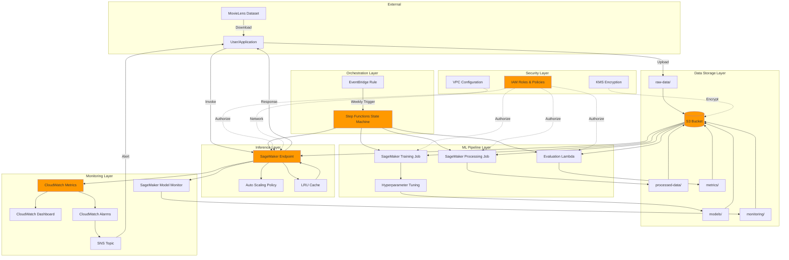

## Detailed Component Architecture

### 1. Data Storage Architecture

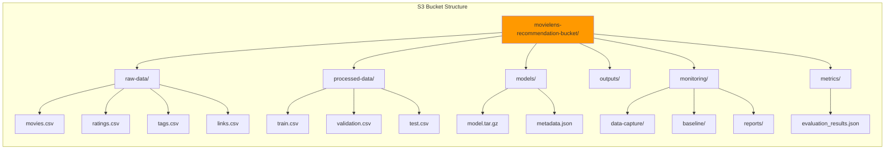

**Features**:
- **Versioning**: Enabled for data lineage tracking
- **Encryption**: SSE-S3 or SSE-KMS at rest
- **Lifecycle Policies**: Archive to Glacier after 90 days
- **Access Control**: Bucket policies with least-privilege access

### 2. ML Pipeline Architecture

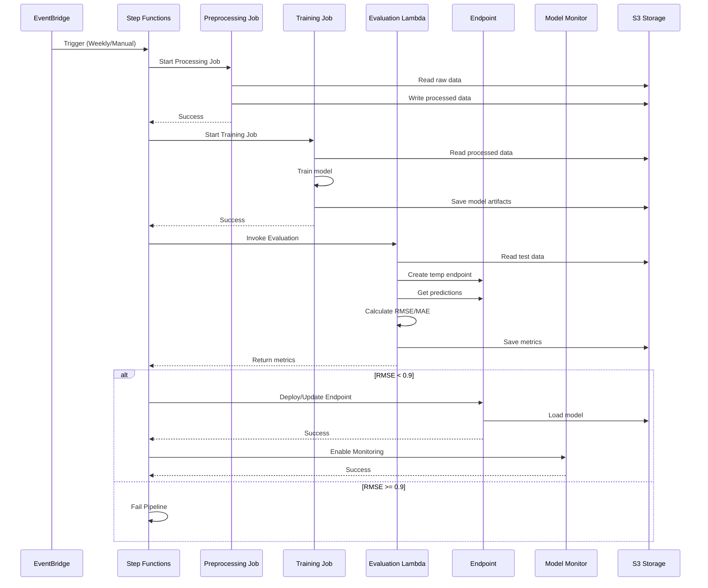

**Pipeline Steps**:
1. **Data Preprocessing**: Transform raw CSV to train/val/test splits
2. **Model Training**: Train collaborative filtering model with PyTorch
3. **Model Evaluation**: Calculate RMSE and MAE on test set
4. **Deployment Decision**: Deploy if RMSE < 0.9 threshold
5. **Monitoring Setup**: Enable data capture and quality monitoring

### 3. Inference Architecture

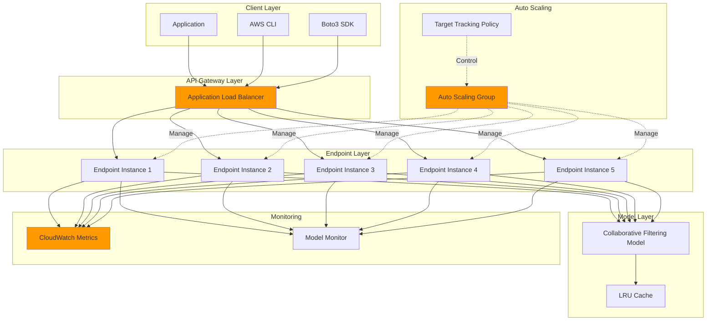

**Scaling Behavior**:
- **Min Instances**: 1
- **Max Instances**: 5
- **Scale Out**: When invocations/instance > 70
- **Scale In**: When invocations/instance < 70
- **Cooldown**: 60s scale-out, 300s scale-in

### 4. Monitoring Architecture

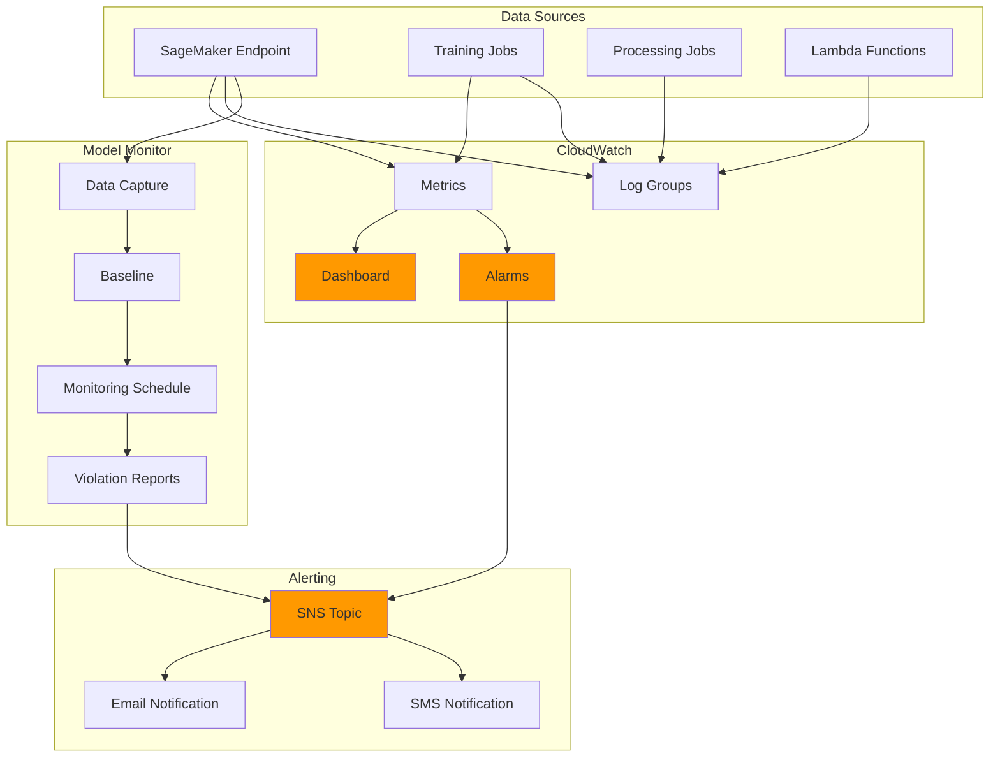

**Monitored Metrics**:
- Invocations per minute
- Model latency (P50, P90, P99)
- Error rates (4xx, 5xx)
- Instance CPU/memory utilization
- Model accuracy drift
- Data distribution drift

**Alarms**:
- High error rate (> 5%)
- High latency (> 1000ms P99)

## Data Flow Diagrams

### Training Data Flow

```mermaid
flowchart LR
    A[MovieLens Dataset] -->|Download| B[Local Storage]
    B -->|Upload| C[S3 raw-data/]
    C -->|Read| D[Preprocessing Job]
    D -->|Transform| E[Train/Val/Test Splits]
    E -->|Write| F[S3 processed-data/]
    F -->|Read| G[Training Job]
    G -->|Train| H[Model Artifacts]
    H -->|Save| I[S3 models/]
    
    style C fill:#FF9900
    style F fill:#FF9900
    style I fill:#FF9900
```

### Inference Data Flow

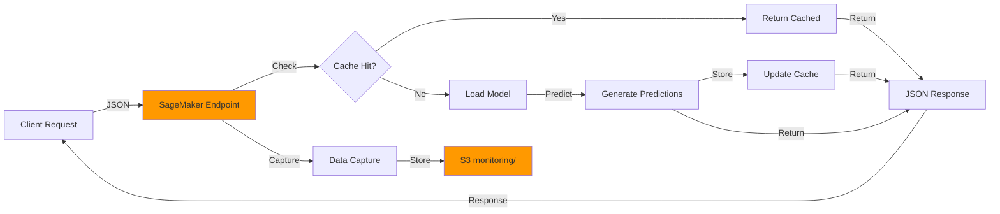

### Monitoring Data Flow

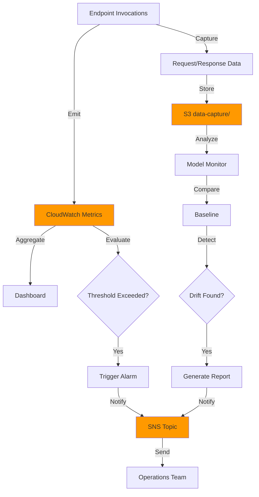

## Security Architecture

### IAM Roles and Policies

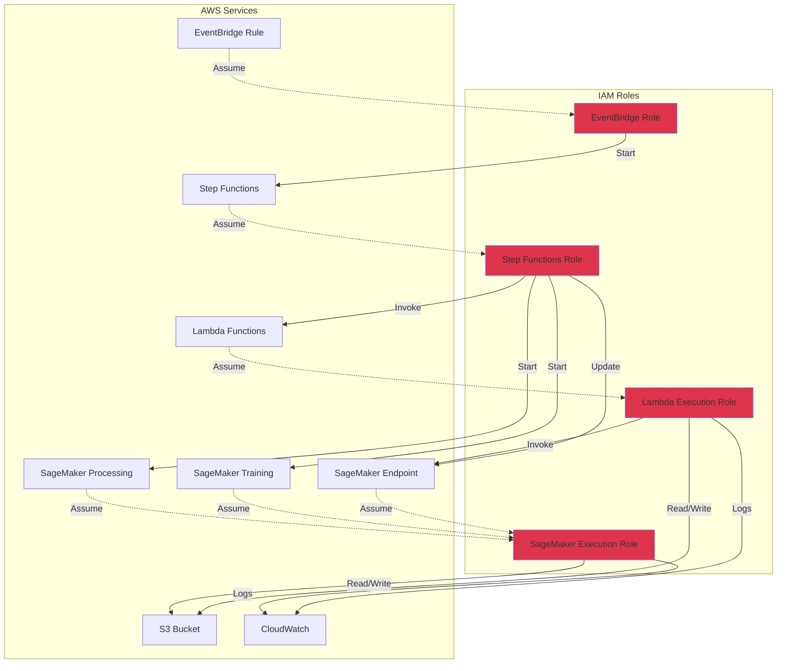

**Security Features**:
- **Least Privilege**: Each role has minimal required permissions
- **Encryption at Rest**: S3 (SSE-S3/KMS), SageMaker volumes (KMS)
- **Encryption in Transit**: TLS 1.2+ for all data transfers
- **VPC Deployment**: Endpoints deployed in private subnets
- **Audit Logging**: CloudTrail enabled for all API calls
- **Bucket Policies**: Restrict S3 access to authorized services only

### Network Architecture

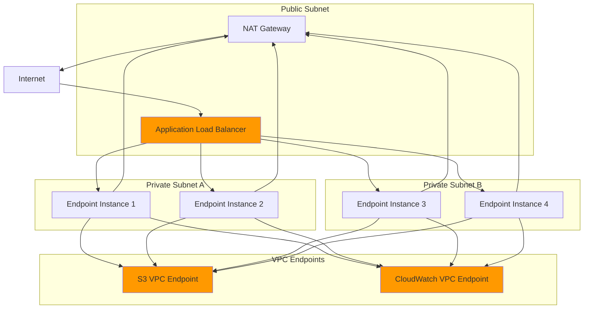

## Deployment Architecture

### Infrastructure as Code

```mermaid
graph TB
    subgraph "Deployment Scripts"
        Deploy[deploy_all.py]
        S3Setup[s3_setup.py]
        IAMSetup[iam_setup.py]
        SMDeploy[sagemaker_deployment.py]
        LMDeploy[lambda_deployment.py]
        SFDeploy[stepfunctions_deployment.py]
        EBDeploy[eventbridge_deployment.py]
    end
    
    subgraph "AWS Resources"
        S3Bucket[S3 Bucket]
        IAMRoles[IAM Roles]
        Lambda[Lambda Functions]
        StepFunc[Step Functions]
        EventB[EventBridge]
        Endpoint[SageMaker Endpoint]
    end
    
    Deploy --> S3Setup
    Deploy --> IAMSetup
    Deploy --> SMDeploy
    Deploy --> LMDeploy
    Deploy --> SFDeploy
    Deploy --> EBDeploy
    
    S3Setup --> S3Bucket
    IAMSetup --> IAMRoles
    SMDeploy --> Endpoint
    LMDeploy --> Lambda
    SFDeploy --> StepFunc
    EBDeploy --> EventB
    
    style Deploy fill:#232F3E
```

**Deployment Order**:
1. S3 bucket creation
2. IAM roles and policies
3. Lambda functions
4. Step Functions state machine
5. EventBridge scheduled rule
6. SageMaker endpoint (after training)

## Performance Characteristics

### Latency Targets

| Component | Target | Typical |
|-----------|--------|---------|
| Endpoint P50 | < 200ms | 150ms |
| Endpoint P90 | < 400ms | 300ms |
| Endpoint P99 | < 500ms | 450ms |
| Preprocessing | < 30 min | 15 min |
| Training (100K) | < 30 min | 20 min |
| Training (25M) | < 2 hours | 90 min |

### Throughput Targets

| Metric | Target | Notes |
|--------|--------|-------|
| Requests/second | 100+ | With 5 instances |
| Concurrent requests | 500+ | With auto-scaling |
| Training throughput | 10K samples/sec | With GPU |

### Scalability

- **Horizontal Scaling**: 1-5 endpoint instances
- **Vertical Scaling**: Instance type upgrades (m5.xlarge → m5.2xlarge)
- **Data Scaling**: Supports datasets up to 100M ratings
- **User Scaling**: Supports millions of users and movies

## Cost Architecture

### Cost Breakdown (Monthly Estimates)

| Component | Development | Production |
|-----------|-------------|------------|
| S3 Storage | $5 | $20 |
| SageMaker Training | $10 | $50 |
| SageMaker Endpoint | $30 | $200 |
| Lambda | $1 | $5 |
| CloudWatch | $5 | $20 |
| Data Transfer | $5 | $30 |
| **Total** | **$56** | **$325** |

### Cost Optimization Strategies

1. **Use Spot Instances**: 70% savings on training
2. **Reserved Instances**: 40% savings on endpoints
3. **S3 Intelligent Tiering**: Automatic cost optimization
4. **Auto-scaling**: Scale to zero during low traffic
5. **Lifecycle Policies**: Archive old data to Glacier

## Disaster Recovery

### Backup Strategy

- **S3 Versioning**: Enabled for all buckets
- **Cross-Region Replication**: Optional for critical data
- **Model Artifacts**: Versioned and retained for 90 days
- **CloudWatch Logs**: Retained for 30 days

### Recovery Procedures

1. **Endpoint Failure**: Auto-scaling launches new instances
2. **Training Failure**: Retry with exponential backoff
3. **Data Corruption**: Restore from S3 versions
4. **Region Failure**: Failover to secondary region (if configured)

### RTO/RPO Targets

- **Recovery Time Objective (RTO)**: < 1 hour
- **Recovery Point Objective (RPO)**: < 24 hours

## Future Enhancements

### Planned Improvements

1. **Multi-Region Deployment**: Active-active across regions
2. **A/B Testing**: Compare model versions in production
3. **Real-Time Features**: Incorporate real-time user behavior
4. **Advanced Models**: Deep learning architectures (NCF, AutoRec)
5. **Explainability**: Add model interpretation features
6. **API Gateway**: Add REST API layer for easier integration

### Scalability Roadmap

- **Phase 1**: Support 1M users, 100K movies (current)
- **Phase 2**: Support 10M users, 1M movies
- **Phase 3**: Support 100M users, 10M movies
- **Phase 4**: Real-time streaming recommendations

## References

- [AWS SageMaker Best Practices](https://docs.aws.amazon.com/sagemaker/latest/dg/best-practices.html)
- [AWS Well-Architected Framework](https://aws.amazon.com/architecture/well-architected/)
- [MovieLens Dataset Documentation](https://grouplens.org/datasets/movielens/)
- [Collaborative Filtering Research](https://dl.acm.org/doi/10.1145/371920.372071)
